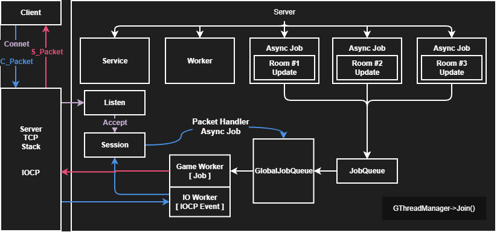
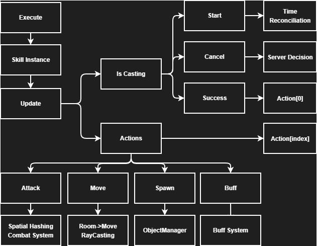
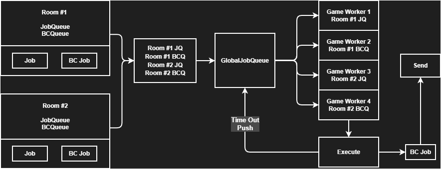
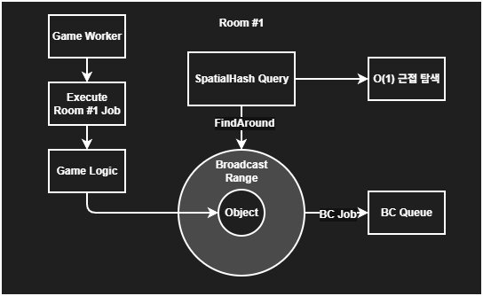
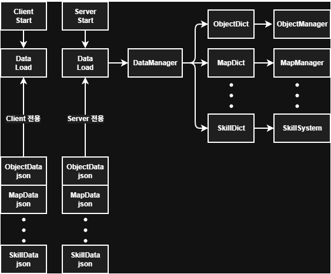

# 🧩 MMO Server Design Report

**Project:** Unreal Client + C++ IOCP Server MMO  
**Purpose:** 서버 구조, 모듈 설계, 핵심 기술 및 데이터 흐름 설명  

---

## 1️⃣ Server Flow (Overview)

### IOCP 기반 GameServer 설계. Lock-free 구조를 위한 JobQueue활용

  
- Client <-> IOCP Server
- Server -> Service , Worker , Room Init 흐름  
- Tick 기반 GameWorker 중심으로 서버 루프 처리  
- Room 단위 독립 처리, 병렬 JobQueue 활용  

> **Trade-off / 선택 이유:** 
> - 서버 프레임 단위 권위 구조를 선택 → 동시성 문제 최소화  
> - 단일 Tick 구조 대신 Room 단위 병렬화를 선택 → CPU 활용 최적화, Worker 수 증가 시 복잡도 상승
> - 병목 최소화, 확장성 고려

## 2️⃣ FSM & Skill System
### 각 Object별 중복된 Skill 설계를 피하기 위해 SkillSystem 도입

- Casting, Skill State를 SkillSystem으로 위임  
- 각 상태(Idle, Moving, Casting, Skill)별 Tick 단위 업데이트  
- Skill 실행 시 Cooldown, Target, Area 등 데이터 기반 처리  
- 서버 권위 + 클라이언트 시각화용 PosInfo 연동  

> 핵심: 서버에서 상태 관리 + SkillLogic 병렬 처리로 성능 최적화

> **Trade-off / 선택 이유:**  
> - FSM 선택 이유: 상태 전이와 행동을 명확하게 모델링 가능  
> - 다른 방법(Flag 기반 처리 등)에 비해 가독성과 유지보수 용이 → 다만 상태 전이가 많으면 코드 복잡도 증가 
> - Skill이 사용된 순서를 보장하기 위해 도입
> - 공통된 Action을 활용한 조합의 Skill로 확장 가능
> - Boss 몬스터 혹은 특수 몬스터의 Skill AI를 Custom Action으로 작성 후 Polymorphism 활용한 설계

## 3️⃣ Room Parallel Processing
### 각 Room에서 GlobalQueue로 일감을 Push하는 BCQueue(JobQueue) 추가

- Room 단위 병렬 처리 구조  
- **JobQueue**: Game Logic Job 등록 및 Worker 분배  
- **BCQueue (Broadcast Queue)**: Room 내 판정 알림을 Async Job으로 즉시 병렬처리  
- Worker별 Lock-free 구조로 동시성 문제 최소화  

> 장점: Player 수가 많아도 각 Room Tick 안정화, Broadcast 지연 최소화

> **Trade-off / 선택 이유:**  
> - Room 단위 병렬 처리 → Tick 안정성 확보  
> - 전체 Tick 단일 Worker 구조보다 CPU 활용 최적화  
> - Worker/Queue 구조 복잡, 디버깅 어려움

## 4️⃣ SpatialHash + Broadcast Nearby

- SpatialHash 기반 근접 탐색 (O(1))  
- Object 중심 근거리 탐색 후 Broadcast  
- 범위 내 이벤트만 전송 → 불필요한 네트워크/CPU 절감  
- GameMap Grid + int 기반 CollisionMap과 float 기반 정밀 충돌 연동  

> 핵심: 대규모 Player/Monster 환경에서도 효율적 이벤트 전파

> **Trade-off / 선택 이유:**  
> - SpatialHash vs Quadtree:  
>   - SpatialHash: O(1) 근접 탐색, 구현 단순, CPU 효율 높음  
>   - Quadtree: 동적 객체 처리 우수, 트리 유지 관리 비용 발생  
> - 선택 이유: MMO 실시간 Room 환경에서 많은 객체를 빠르게 탐색해야 했기 때문에 SpatialHash 채택 → 메모리 충돌/정밀도 제한은 감수  

## 5️⃣ Data-driven Design

- Skill, Monster, AI Behavior, CollisionMap 등 데이터 기반 관리  
- Config 파일/DB 기반 동적 로딩 가능  
- 코드 하드코딩 최소화 → 유지보수 용이, 확장성 확보  
- Benchmark 및 최적화 단계별 적용 가능  

> 장점: 게임 밸런스 조정, 신규 컨텐츠 추가 시 서버 코드 변경 최소화

> **Trade-off / 선택 이유:**  
> - 코드 하드코딩 최소화 → 유지보수와 확장성 용이  
> - 대안: Hardcoded Behavior / Script 기반 → 성능은 높지만 유연성 낮음  
> - 선택 이유: 서버와 클라이언트 구조가 확장될 예정이어서, 데이터 중심 설계를 우선시

### ✅ Summary

- 서버 아키텍처: Tick 기반 GameWorker + Room 단위 병렬 처리  
- Skill / AI / Broadcast 시스템 모두 FSM + Data-driven 설계  
- SpatialHash + BroadcastNearby로 대규모 MMO 환경에서도 CPU/Network 효율 최적화  
- JobQueue / BCQueue 구조로 동시성 안전성 확보