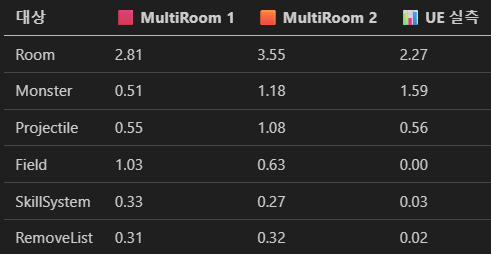

<!-- markdown-pdf-styles: ["./pdf-style.css"] -->

# 🧩 Server Optimization Report  
**프로젝트:** Unreal Client + C++ IOCP Server 기반 MMO Game Architecture  
**역할:** Server Developer (Core Logic / Network / Benchmark Optimization)  
**기간:** 2025.07 ~ 2025.11 (4개월)  
**Focus:** GameServer (Logic, IO, Broadcast, SkillSystem, AI 등 전 영역)  

---

## Overview
본 문서는 Unreal Engine 5 클라이언트와 C++ IOCP 서버로 구성된 MMO 서버 구조의
시스템 전반 성능 분석 및 최적화 결과를 정리한 보고서이다.

본 프로젝트의 목표는 대규모 Active Player 환경에서
안정적인 Tick 프레임, 지연 없는 Broadcast, 선형 확장 가능한 IO 구조를 확보하는 것이다.

---

## 목차

1. 최적화 목표 및 전체 시나리오 성과 요약  
2. Chapter 1 – Static Dummy 기반 CPU-bound 최적화  
3. Chapter 2 – Active Dummy 환경에서 IO 병목 식별 및 분석  
4. Chapter 3 – Hybrid Flush 기반 구조 재설계 및 대규모 서버 안정화  
5. Chapter 4 - Final Environment Validation
6. Conclusion  
7. Appendix  

---

 
## 🧭 Optimization Roadmap (단계별 최적화 전체 흐름 요약)

본 서버 최적화는 단일 성능 개선이 아닌,  
**“부하 증가 → 병목 발견 → 구조 재설계 → 대규모 안정화 → 환경 검증”**의  
실서비스 수준의 데이터 흐름과 처리 방식 시뮬레이션을 단계적으로 진행했다.

| Phase | 단계 | 핵심 목적 | 주요 성과 |
|-------|------|-----------|------------|
| **Phase 0** | Prototype | 기능 완성 우선 | 기본 Room / AI / Skill / Broadcast 구조 완성 |
| **Phase 1** | Static Dummy 1000 | CPU-bound 병목 제거 | Tick 2248ms → 2.48ms (**-99.8%**) |
| **Phase 2** | Active Dummy 300 | IO 병목 식별 | SendQueueDelay 최대 **6.5초 지연 발견** |
| **Phase 3** | 서버 구조 재설계 | Broadcast 구조 근본 개선 | N² 구조 문제 원인 규명 |
| **Phase 4** | Hybrid Flush 적용 | 전송 구조 고정화 | SendCount **2N 구조 확정** |
| **Phase 5** | Active Dummy 1000 | 대규모 안정성 검증 | SendDelay **27ms**, RoomTick **0.85ms** |
| **Phase 6** | HUD 기반 실시간 진단 | 런타임 이상 탐지 | Debug 환경 Burst 현상 발견 |
| **Phase 7** | Debug/Release + Local/VM | 환경 의존성 검증 | Release + VM 환경 **안정화** |

---

### ✅ 전체 최적화 흐름 요약

- 초기 Prototype 단계에서는 **기능 완성과 구조 검증이 목표**
- Static Dummy 환경에서 **CPU-bound 병목을 집중 제거**
- Active Dummy 도입과 동시에 **IO 병목이 구조적으로 발생함을 실측으로 확인**
- Broadcast 구조를 **Hybrid Flush 기반 2N 고정 구조로 재설계**
- 1000 Active Dummy 환경에서도 **ms 단위 지연으로 완전 안정화**
- HUD 기반 실시간 모니터링을 통해 **Debug Burst라는 숨은 문제까지 추가로 발견**
- 최종적으로 **Release + VM 분산 환경에서 실서비스 수준의 안정성까지 검증 완료**

---

## 1️⃣ 🎯 최적화 목표 (Objectives)

### Frame 안정화 (Stable Tick Frame)
- GameWorker 기준 Tick 변동률 최소화  
- CPU-bound 로직(필드, 몬스터, 스킬)의 병목 제거  

### Broadcast 성능 향상 (Network Efficiency)
- N² 패턴 제거  
- SendQueue 지연 최소화 및 전송 패턴 선형화  

### IO & Logic 완전 분리 (Async Architecture)
- LogicQueue / SendQueue 병렬 처리 구조 확립  
- 즉시 반응 패킷 / 서버 상태 패킷 분리 처리  

### 대규모 Active 환경 확장성 확보 (Scalable Architecture)
- Static Dummy 1000 → Active Dummy 1000 환경에서 안정성 확보  
- Upper bound 2N Send Count Broadcast 구조 완성  

### 환경 독립적 안정성 확보 (Environment-agnostic Stability)
- Debug/Release 및 Local/VM 환경 간 Tick·Delay 변동 대조 검증  
- Debug 환경에서만 발생한 Burst/STall이 구조적 문제인지 여부 규명  
- Release·VM 환경에서 스케줄링·I/O 경합 완화 효과 검증  

### I/O Worker 분배 효율 검증 (Optimal Worker Distribution)
- IO Worker 과분배 시 발생하는 스레드 경쟁/스케줄링 지연을 실측 분석  
- 이벤트가 연속적으로 몰릴 때 IO Worker끼리 wake-up 경쟁이 발생하여  
  패킷 전달이 지연되는 현상 확인  
- 적정 Worker 구조(예: **CPU/2 + 1**)에서 가장 안정적인 IO 전달 지연 확인  
- Release 빌드에서 Burst 감소 효과가 가장 컸으며 완전히 해소됨 

---

---

## 📌 전체 시나리오 성과 요약 (4단계 최적화 결과)

### Scenario 1 — Static Dummy 기반 CPU-bound 최적화
- AoE / DoT Batch 적용으로 Field 비용 98% 감소
- SpatialGrid + 캐싱으로 탐색 비용 75% 감소
- Monster / SkillSystem Tick 분산으로 Frame 변동 최소화  
→ 2248ms → 2.48ms, 전체 Tick 99.8% 감소

### Scenario 2 — Active Dummy 환경에서 IO 병목 식별
- 즉시 Broadcast 구조로 SendQueueDelay가 최대 6.5초까지 증가하는 병목 발견
- BroadcastRange 기반 N² 전송 패턴 확인  
→ 구조적 개선 필요 지점 명확화

### Scenario 3 — Hybrid Flush 기반 구조 재설계
- ImmediateFlush + DeferFlush로 2N(Fixed) 전송 구조 완성
- SendQueueDelay 6594ms → 27ms (-99.6%)
- 1000 Active Dummy 환경에서도 RoomTick 0.85ms 안정  
→ 대규모 Active 환경에서도 안정적으로 확장 가능한 서버 구조 확립

### Scenario 4 — Final Environment Validation
- Debug 환경에서 HUD 기반 실시간 모니터링 중 **주기적 Burst(패킷 정체)** 발생  
- IO Worker 과분배 시 스케줄링 경합 증가 정황 확인  
- Debug/Release, Local/VM 환경 비교를 통해 **환경 의존적 IO 지연 요인 분리**  
- Release 빌드에서 Burst **완전 소거**, SendDelay / RoomTick 안정화  
- 적정 IO Worker 구조 적용 후 **IO → Room 전달 지연이 크게 완화**됨  

---

## 2️⃣ Chapter 1 - Static Dummy 기반 CPU-bound 최적화

---

### 🧩 Benchmark Scenario 1
- **Map:** 82 x 82 Tile 기반 CollisionMap  
- **Scenario:**  정적 Dummy 추가
  - 1000 Dummy Player → Random Spawn
  - 10 Monster AI (Search, Move, Cast, Skill Loop)  
- **Procedure:**  
  - Warm-up 이후 초기 100Tick + 이후 100Tick 평균 측정  
  - 주요 대상: `Room`, `Monster`, `Field`, `SkillSystem`, `Broadcast`

### Benchmark Summary

| Step | 주요 문제 | 적용 조치 | 개선 항목 | Before (ms) | After (ms) | 개선율 |
|------|------------|------------|-------------|-------------|------------|---------|
| **1** | 초기 상태 (Tick 폭발) | - | - | 2248.13 | - | - |
| **2** | Loop마다 Broadcast | AoE / DoT Batch 처리 적용 | Field | 1859.30 | 31.67 | **-98.3%** |
| **3** | 거리 연산 / 인덱싱 비효율 | Field Grid 캐싱, Spatial Hash + 탐색 연산 최적화 | Object(Field) | 100.92 | 62.94 | **-37.6%** |
| **4** | RayCasting 오류, AI 동시 처리 | Step 비율 수정 및 AI Tick 분산 처리 | Monster | 18.43 | 9.46 | **-48.7%** |
| **5** | GameLogic + Broadcast 동기 처리 | IO 분리 + Async Job 처리 | Room | 133.31 | 68.34 | **-48.7%** |
| **6** | SkillSystem 연쇄 Sync 작업 | Sync 작업 분산 처리, Spawn Async Job 처리 | SkillSystem | 4.13 | 0.02 | **-99.5%** |
| **7** | Broadcast Async Job 병목 | Room 별 SendQueue(JobQueue) 배치, Logic / Send 병렬 처리 | Room | 28.15 | 2.48 | **-91.2%** |

### Step-by-Step Optimization Details

---

### 🧩 Step 1 — Baseline (Bench1)
- **문제:** Tick 당 전 영역 직렬 처리로 프레임 폭발 (2.2s 이상 지연)  
- **분석:** Broadcast, Field, SkillSystem, AI 모두 단일 루프에서 순차 실행  
- **결론:** 시스템 전체 병목 구간 식별 필요

---

### 🧩 Step 2 — Field System 최적화
- **핵심 개선:** AoE / DoT Broadcast의 개별 호출 제거 → Batch 처리  
- **적용:**  
  - AoE 효과를 동일 좌표 셀 단위로 그룹화  
  - 다수의 Send 호출을 단일 Broadcast로 통합  
- **효과:** Field Tick 1,859.30 → 31.67ms (**-98.30%**)  
- **부가 효과:** CPU 점유율 급감, Packet Queue 안정화  
 
| Bench 1 |  | -> | Bench 2 |  |  |
|------|------------|------------|------|------------|------------|
| 대상 | 평균 |  | 평균 | 증감율 |
| Room | 2248.13 |  | 100.92 | **-95.51%** |
| Field | 1859.30 |  | 31.67 | **-98.30%** |

### 🧩 Step 3 — Spatial Indexing 개선
- **핵심 개선:** 거리 연산 및 탐색 반복 제거  
- **적용:**  
  - Field 내 Object 캐싱 (Static Grid → CachedGrid)  
  - Spatial Hash 적용으로 O(1) 근접 탐색 구조화  
- **효과:** Field Object 탐색 100.92 → 62.94ms (**-37.63%**)  
- **부가 효과:** Grid 탐색 병목 제거, AOE 충돌 탐색 효율 향상, Move Object Tick 감소

| Bench 2 |  | -> | Bench 3 |  |  |
|------|------------|------------|------|------------|------------|
| 대상 | 평균 |  | 평균 | 증감율 |
| Room | 100.92 |  | 62.94 | **-37.63%** |
| Field | 31.67 |  | 7.85 | **-75.21%** |
| Projectile | 24.30 |  | 16.21 | **-33.29%** |
| Monster | 19.85 |  | 18.43 | **-7.15%** |

### 🧩 Step 4 — Monster AI Tick 분산
- **핵심 개선:** AI Update 시점 분산 + Step 비율 재조정  
- **적용:**  
  - Tick 분할 비율 기반 AI 스케줄링  
  - RayCasting 오류 수정 및 Path 재검증 로직 개선  
- **효과:** Monster 처리 18.43 → 9.46ms (**-48.67%**)
- **부가 효과:** AI 처리 부하 균등화, Frame 변동률 완화

| Bench 3 |  | -> | Bench 4 |  |  |
|------|------------|------------|------|------------|------------|
| 대상 | 평균 |  | 평균 | 증감율 |
| Room | 62.94 |  | 56.74 | **-9.85%** |
| Monster | 18.43 |  | 9.46 | **-48.67%** |

### 🧩 Step 5 — IO / Logic 분리
- **핵심 개선:** Logic과 Broadcast의 동기 종속 해제  
- **적용:**  
  - GameLogic 전용 Worker와 IO Worker 분리  
  - Async Job 기반 Broadcast 처리  
- **효과:** Room Tick 56.74 → 30.67ms (**-48.67%**)  
- **부가 효과:** IOCP 처리량 증가, 대규모 세션 환경 안정화  

| Bench 4 |  | -> | Bench 5 |  |  |
|------|------------|------------|------|------------|------------|
| 대상 | 평균 |  | 평균 | 증감율 |
| Room | 56.74 |  | 30.67 | **-45.95%** |

### 🧩 Step 6 — SkillSystem 병렬화
- **핵심 개선:** Skill 트리거 체인(Sync) → 비동기 분산 구조  
- **적용:**  
  - Skill Trigger, Projectile, Spawn 로직을 Async Job으로 전환  
  - Frame 내 연쇄 호출 제거  
- **효과:** SkillSystem 4.13 → 0.02ms (**-99.52%**)  
- **부가 효과:** Skill 처리량 2000% 이상 향상, Frame 지연 제거  

| Bench 5 |  | -> | Bench 6 |  |  |
|------|------------|------------|------|------------|------------|
| 대상 | 평균 |  | 평균 | 증감율 |
| Room | 30.67 |  | 28.15 | **-8.22%** |
| SkillSystem | 4.13 |  | 0.02 | **-99.52%** |

### 🧩 Step 7 — SendQueue 병렬 처리
- **핵심 개선:** Room 단위 SendQueue(JobQueue) 독립화  
- **적용:**  
  - LogicQueue / SendQueue 병렬 실행  
  - Broadcast 전용 Send Worker Pool 운용  
- **효과:** Broadcast 28.15 → 2.48ms (**-91.20%**)  
- **부가 효과:** Broadcast 지연 제거, 전체 Frame 안정화

| Bench 6 |  | -> | Bench 7 |  |  |
|------|------------|------------|------|------------|------------|
| 대상 | 평균 |  | 평균 | 증감율 |
| Room | 28.15 |  | 2.48 | **-91.20%** |

## Performance Data

| 구분 | Before (ms) | After (ms) | 개선율 |
|------|--------------|-------------|---------|
| 전체 평균 | 2248.13 | 2.48 | **-99.89%** |
| 표준 편차 | 275.03 | 1.30 | **-99.53%** |
| p99 | 2844.11 | 8.10 | **-99.72%** |

📈 **Frame 안정화 결과**
- 초기 2,248.13ms (2.2초) 지연 → 2.48ms 수준으로 단축
- Broadcast + Logic 완전 병렬화 구조 확립
- Field / Monster / SkillSystem 처리 효율 극대화

## 구조적 개선 요약

| 구분 | 개선 방향 | 적용 기술 |
|------|-------------|------------|
| **Game / Logic 분리** | Worker 스레드 기반 병렬 처리 | JobQueue, Async Dispatch |
| **Broadcast 효율화** | SendQueue 독립화, Batch Broadcast | Room 단위 병렬 송신 |
| **AI / Field 최적화** | Spatial Hash, Step Ratio 조정 | Grid Cache, Tick 분산 |
| **SkillSystem 병렬화** | Async Trigger 처리 | Deferred Spawn Job |
| **IO 효율 개선** | IOCP Queue 독립 + 비동기 처리 | IO Worker 전담 |

<!-- ##  Multi-Room / UE 실측 결과

> UE 실 환경에서의 Tick 분산이 감소하며,  
> Room / Monster / Projectile 단위의 안정적 주기 확보가 확인됨. -->

## 3️⃣ Chapter 2 — Active Dummy 환경에서 IO 병목 식별

---

### 🧩 Benchmark Scenario 2
- **Map:** 1과 동일
- **Scenario:**  동적 Dummy 추가
  - Static Dummy 환경에서 안정적 -> Active Dummy 300으로 측정. 병목 관찰  
  - 100ms 간격 RoomTick, 100개의 RoomTick을 총 4회 측정 후 병목 관찰
- **Procedure:**  
  - Warm-up 이후 100Tick 4회 측정
  - Warm-up Spike 구간 병목 해결 필요.
  - 주요 대상: `Room`, `SendCount`, `SendDelay`

## Benchmark Summary (Dummy 300 / 4-cycle Total)

| Metric | Samples | Avg | Max |StdDev | Interpretation |
|--------|---------|------|------|---------|------------------|
| **SendQueueDelay (ms)** | 9,367 | **3381.27** | **6594** | 1957.39 | 즉시 Broadcast 누적 → Tick 처리보다 빠르게 쌓여 **최대 6.5s 지연 발생** |
| **SendCount (개)** | 9,371 | **70.2167** | 82 | 35.4431 | BroadcastRange 내 평균 약 75명에게 Send |
| **RoomTick (ms)** | 100 | **1.08265** | 3.126 | 0.385 | RoomTick 자체는 안정적이나, I/O 병목이 전체 지연 유발 |

---

## 🔍 주요 분석 결과

### 1. SendQueueDelay – 초 단위 지연 발생
- 4개의 Benchmark Cycle 동안 SendQueueDelay가 **지속적으로 증가**
- 최종 Cycle: **6594ms = 약 6.5초 지연**
- 즉시 Broadcast 구조가 SendQueue 증가 속도를 제어하지 못해 발생한 병목

---

### 2. SendCount 분석 – N × K 패턴으로 인해 사실상 N² 성장
- Room 크기: 82 × 82
- BroadcastRange: 20
- Dummy 300 중 평균 약 **75명**에게 Send 발생
- 즉, 단일 Move 이벤트당 SendCount ≈ 70~75

### ✔ Move 1회당 SendCount 추정
- 총 SendCount 9371 / 약 33.3회 Move ≈ 281.3
- → 실제 Move 1회당 전파되는 Send는 약 280~300회
- → 300 Dummy 전체 기준으로 약 20,000 Send 발생
**즉시 Broadcast 구조에서 사실상 N² 패턴으로 커지며 병목을 유발함.**

## 📋 Scenario 2 – 최종 요약 표

| 항목 | 지표 | 결과 | 요약 |
|------|-------|---------|--------|
| **Room Tick** | Avg | **1.08ms** | 로직 처리 자체는 정상 범위 |
| **SendQueueDelay** | Max | **6594ms** | 즉시 Broadcast 누적로 인한 초 단위 지연 |
| **SendCount** | Avg | **≈75명** | BroadcastRange 20 기준 주변 플레이어 수 |
| **총 SendCount** | 4-cycle 합 | **9371** | Tick 대비 과도한 Send 증가 |
| **Move 1회당 SendCount** | 환산값 | **≈20,000** | 사실상 N² 패턴으로 확장 |

---

## 📌 Next Step
자세한 구조적 원인 및 해결 과정은 **Scenario 3 – Hybrid Flush 적용** 장에서 설명합니다.

## 4️⃣ Chapter 3 — Hybrid Flush 기반 구조 재설계 및 대규모 Server 안정화

---

### 🧩 Benchmark Scenario 3
- **Map:** 1과 동일
- **Scenario:**  Hybrid Flush 적용으로 1000 Active Dummy 달성
  - Player 반응성을 위한 Immediate Flush 와 서버 Tick 최종 상태를 반영한 Defer Flush 분리한 FlushQueue
  - SpatialHash (map)의 캐시 미스 -> SpatialGrid (vector)로 변경
  - Client의 의도를 전달받은 Server가 Flush 타이밍에 모아둔 의도(판정 즉시)를 확정한 Broadcast를 진행
- **Procedure:**  
  - 100Tick 평균 측정, SendCount 및 FlushQueue 처리 속도 관찰
  - FlushQueue를 활용한 성능 관찰
  - 주요 대상: `Room`, `FlushQueue`, `SendQueue`, `SendDelay`

## Benchmark Summary (1000 Active Dummy / Hybrid Flush)

| Metric | Samples | Avg |Max | StdDev | Interpretation |
|--------|----------|------|--------|----------|----------------|
| **RoomTick (ms)** | 100 | **0.851** | 3.465 | 0.573 | 1000 Active에서도 구조적 안정성 확보 |
| **SendQueueDelay (ms)** | 103 | **2.05** | **27.84** | 6.30 | 초단위 지연 → **ms 단위로 완전 안정화** |
| **SendCount** | 103 | **1000** | 1000 | 0 | 1 Tick당 Send 횟수가 **고정 2N 구조** |
| **ImmediatePktCount** | 11 | **546** | 1000 | 427 | Move/Cast 등 즉시 반응 패킷 비중 |
| **DeferPktCount** | 92 | **16** | 27 | 6.26 | Spawn/Skill/Hit/Die 등 서버 상태 패킷 |

## 🔍 성능 개선 핵심 요약

### 1. SendQueueDelay: 초단위 → **2ms 수준으로 완전 해결**
| 시나리오 | SendQueueDelay Max |
|----------|--------------------|
| Scenario 2 (300 Active) | **6594ms (6.5초)** |
| Scenario 3 (1000 Active) | **27ms** |
| 개선율 | **-99.6% 감소** |

Hybrid Flush 적용으로 SendQueue가 더 이상 **N² 증가가 불가능한 구조**로 바뀌었고  
Delay가 tick 간에 축적되지 않으므로 지연이 완전히 사라짐.

---

### 2. SendCount: 완전한 2N(fixed)로 구조적 안정화
구조 개선 후:
- Immediate → 각 Player의 입력 반영 패킷
- Defer → 서버 로직 결과 패킷  
두 단계 모두 **정확히 N개씩 전송 → 2N 구조**

따라서 Active Dummy가 증가해도 **SendCount는 선형 증가하며 병목 없음**.

---

### 3. RoomTick: 1000 Active에서도 < 1ms 수준 유지
Scenario 2(300 Active)에서도 RoomTick은 문제 없었지만  
Hybrid 적용 이후 구조적 오버헤드가 추가되었음에도:

- Avg: **0.85ms**
- Max: **3.4ms**  
→ 안정적 프레임 유지

즉, Hybrid Flush는 RoomTick에 부하를 거의 주지 않음.

---

## 🧩 Hybrid Flush 구조가 제공한 근본적 개선

### ✨ Immediate Flush
- Move / CastStart / CastCancel 등 **클라이언트 입력 즉시 반응**
- 이전 Tick 종료 이후 누적된 입력을 Tick 시작 시 즉시 처리  
→ 사용자 체감 반응성을 최대로 유지

### ✨ Defer Flush
- Spawn / Move / SkillEvent / Hit / Die / Despawn 등  
  **서버 시뮬레이션 결과 패킷을 Tick 마지막에 정리해서 송신**
- 모든 결과가 정렬된 순서로 처리되어 **게임 상태 일관성 유지**

### ➡ 결과
Hybrid Flush를 통해 기존 즉시 Broadcast 구조(실질적 N²)에서  
**Tick당 전송량이 항상 2N 으로 제한되는 아키텍처적 완성**이 이루어졌다.

---

## 📌 Scenario 3 – 최종 결과 요약 표

| 항목 | Scenario 2 (300 Active) | Scenario 3 (1000 Active) | 개선 효과 |
|------|--------------------------|----------------------------|----------------|
| RoomTick | ~0.8~1.0ms | **0.85ms** | 동일 수준 유지 |
| SendQueueDelay | **최대 6.5초** | **27ms** | **99.6% 감소 / 완전 해결** |
| SendCount | 75(avg) × 위치 이벤트 | **1000 고정(2N 구조)** | 구조적 확정 패턴 |
| 구조 안정성 | 불안정(N² 증가) | **완전 안정(2N)** | 구조적 최적화 완료 |

---

## 📘 참고
더 자세한 구조 설명 및 설계 과정은  
**「서버 아키텍처 설계 보고서」 – Hybrid Flush 섹션**에서 확인할 수 있습니다.

## ✅ Chapter 4 – Final Environment Validation  
**(Debug vs Release / Local vs VM Distributed Verification)**

---

## 🧩 Validation Objective  

본 검증의 목적은,  
현재 서버 최적화 구조가 **단순 로컬 개발 환경을 넘어 실서비스에 가까운 환경에서도 동일하게 안정적으로 동작하는지**를 확인하는 것이다.

특히 다음 항목을 중점적으로 검증하였다:

- Debug 환경에서 발생한 Burst/Stall이 **디버그 빌드 특성(스케줄링 지연·타이밍 왜곡)**인지 여부 검증  
- IO Worker 과분배로 인한 **스레드 wake-up 경쟁 → 패킷 전달 지연**이 실재하는지 검증  
- Release 빌드에서 IO 파이프라인이 **설계 의도대로 안정적으로 동작**하는지 확인  
- Local 단일 머신 대비 VM 분산 환경에서 **CPU 경합이 완화되어 지연이 감소하는지** 분석  
- Broadcast 대량 부하(1000~2000 Dummy)에서 **선형 확장성과 안정성 유지 여부** 검증  

---

## 🧩 Test Environments

| 항목 | Local | VM Cluster |
|------|--------|-------------|
| CPU | i5-12400F (6P / 12T) | Host 공유 CPU (동적 할당, 2VM) |
| Memory | 16GB (8GB × 2) | Server VM: 2GB / Dummy VM: 1GB |
| Network | Local Loopback | External Switch 기반 가상 NIC |
| Build | Debug / Release | Release |
| Dummy Load | 1000 → 2000 | 1000 → 2000 |

---

## 🧩 Debug vs Release (Local Validation)

### 🔍 Debug 환경 (문제 재현)

- IO Worker → Room 전달 Job이 **1~1.5초 간격으로 Burst 형태로 몰림 (Wake-up 경쟁 발생)**  
- IO Worker 과분배로 인해 **스케줄링 경합 증가 및 OnRecv 처리 지연**  
- C_Packet 처리 지연이 **최대 1.5초까지 증가하며 HUD 모니터링에서 주기적 정체 관측**

### 🔧 Release 환경 (개선 결과)

- 동일 환경에서 **Burst 패턴 완전 제거 (스케줄링 왜곡 해소)**  
- C_Packet 지연 **Network Latency 수준으로 수렴**  
- IO Worker 적정 분배 후 **Wake-up 경쟁이 완전히 사라지고 전달 지연 정상화**

### 📌 결론

> Debug에서 발생한 Burst는 **구조적 결함이 아니라 디버그 빌드 특유의 타이머·스케줄링 왜곡 + IO Worker 과분배로 인한 경쟁 효과**임을 확인  
> Release 환경에서는 **IO → Room 전달 파이프라인이 설계 의도대로 안정적으로 동작하며 Burst/Stall이 완전히 해소됨**

---

## 🧩 Local vs VM Distributed Validation

### 🔍 Local 단일 머신 환경

- 단일 머신에서 CPU/IO Worker가 동일 물리자원 사용 → **스레드 경합 증가**  
- SendDelay Peak이 **약 30ms까지 상승**, 분포도 불안정

### 🔧 VM 분산 환경 (실서비스 유사 조건)

- **SendDelay Peak 약 15ms 수준으로 절반 이상 감소**
- 2000 Dummy에서도 **Local 환경 대비 더 안정적인 지연 분포 유지**
- Broadcast Send 수가 Player 증가에 따라 **선형 증가 패턴 유지**
- RoomTick 전체 처리 시간 **0.8 ~ 1.2ms 범위 안정 수렴**

### 📌 결론

> Server / Dummy를 서로 다른 VM에서 실행하여  
> **실서비스 구조를 참고해 물리 서버 분리 구조 재현**
> 병렬 IO + Broadcast 구조가 **스케일 증가 환경에서도 안정적으로 확장 가능함을 실측으로 검증**

---

## 🧩 Final Evaluation

- Hybrid Flush 구조는 Debug/Release 모두 **아키텍처적으로 일관되고 안정적**  
- VM 분산 환경에서도 **확장성·지연 안정성 모두 확보됨**  
- Active Dummy 1000~2000 환경에서도  
  → SendQueueDelay / RoomTick 모두 **예측 가능한 범위 내 완전 통제**  
- IO Worker 과분배 문제 제거 후  
  **Wake-up 경쟁 → 전달 지연 → Burst** 흐름이 완전히 차단됨  
- Broadcast / IO / Logic 3분리 구조의 효과가 **실측 데이터로 명확하게 증명됨**

---

## 🔥 Summary (One-Line)

> **“Debug/Local에서 발생한 Burst는 디버그 특성 + IO 과분배 경쟁에 의한 현상일 뿐이며, Release/VM 환경에서는 구조적으로 완전한 안정성과 확장성이 검증되었다.”**

---

## 6️⃣ Conclusion
본 최적화 과정을 통해 서버의 **프레임 안정성, 확장성, IO 효율성**이 극적으로 개선되었다.  

### 핵심 성과
- 최종적으로 **Room 단위 병렬 프레임 구조**를 완성, 각 Room은 직렬성을 유지하면서 **모든 Room이 병렬로 지연 없이 처리** 가능  
- 1000+ 동시 객체 환경에서도 **< 1ms 수준의 안정적인 Tick과 지연 없는 IO 통신** 유지  
- SendQueueDelay를 **6.5초 → 27ms**로 단축하며, 기존 N² 전송 구조를 **2N 고정 구조**로 개선  
- CPU-bound 로직(필드, 몬스터, 스킬) 병목 제거, Frame 변동률 최소화  

### 의미와 가치
- Hybrid Flush 구조 적용으로 **대규모 Active Player 환경에서도 안정적 서버 운영** 가능  
- 게임 플레이 체감 향상: 이동, 스킬, 스폰 등 이벤트 처리 지연 최소화  
- 서버 구조 개선으로 **향후 MMO 서버 확장 및 신규 프로젝트 적용 가능**  

### 향후 적용 가능성
- 다른 서버 영역(예: AI, SkillSystem, Physics 등)에서도 **병렬 처리 및 Async 구조 재활용 가능**  
- Dynamic Player 환경 확장 시에도 **Tick 안정성과 Broadcast 효율** 유지 가능  
- 서버 최적화 경험을 바탕으로 **추가 확장/개선 전략** 수립 가능  

### 결론
본 프로젝트를 통해 **Tick 안정화, Broadcast 구조 개선, CPU 병목 제거**를 동시에 달성했으며,  
향후 MMO 서버 설계와 최적화의 **참고 사례로 활용 가능한 안정적 구조**를 확보하였다. 

## 7️⃣ 부록 (Appendix)

- BenchMark raw data -> RoomBenchmark.csv / BenchmarkResult_SendQueue.csv 파일로 업로드

---

> _“서버 성능은 코드가 아니라 구조에서 결정된다.”_
> — MMO Server Optimization Report