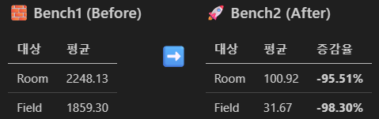
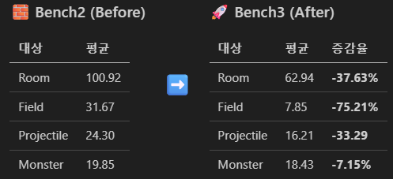
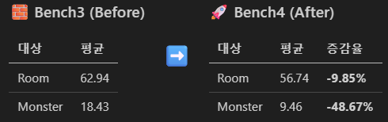
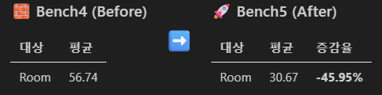
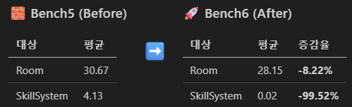
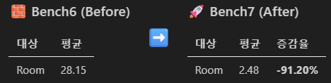

<!-- markdown-pdf-styles: ["./pdf-style.css"] -->

# 🧩 Server Optimization Report  
**프로젝트:** Unreal Client + C++ IOCP Server 기반 MMO Game Architecture  
**역할:** Server Developer (Core Logic / Network / Benchmark Optimization)  
**기간:** 2025.07 ~ 2025.10  
**Focus:** GameServer (Logic, IO, Broadcast, SkillSystem, AI 등 전 영역)  

---

## 1️⃣ Overview
Unreal Engine 5 클라이언트와 C++ 기반 IOCP 서버로 구성된 MMO 구조를 설계 및 구현.  
서버는 `Room` 단위의 GameWorker 구조를 기반으로 비동기 JobQueue를 운용하며,  
Tick 단위의 게임 로직, 브로드캐스트, AI, SkillSystem을 포함한 전 영역 성능을 측정 및 개선.

**최적화 목표**
- GameWorker 단위의 **Frame 안정화**
- **Broadcast 지연 최소화** 및 비동기화
- **AI / Field / SkillSystem 병렬 효율** 향상
- **IOCP 기반 Async 처리율 극대화**

### 🧩 Benchmark Scenario
- **Map:** 1600 Tile 기반 CollisionMap  
- **Scenario:**  
  - 1000 Dummy Player → Random Spawn & Move (Interval 300ms)  
  - 10 Monster AI (Search, Move, Cast, Skill Loop)  
- **Procedure:**  
  - Warm-up 이후 초기 100Tick + 이후 100Tick 평균 측정  
  - 주요 대상: `Room`, `Monster`, `Field`, `SkillSystem`, `Broadcast`

## 2️⃣ Benchmark Summary

| Step | 주요 문제 | 적용 조치 | 개선 항목 | Before (ms) | After (ms) | 개선율 |
|------|------------|------------|-------------|-------------|------------|---------|
| **1** | 초기 상태 (Tick 폭발) | - | - | 2248.13 | - | - |
| **2** | Loop마다 Broadcast | AoE / DoT Batch 처리 적용 | Field | 1859.30 | 31.67 | **-98.3%** |
| **3** | 거리 연산 / 인덱싱 비효율 | Field Grid 캐싱, Spatial Hash + 탐색 연산 최적화 | Object(Field) | 100.92 | 62.94 | **-37.6%** |
| **4** | RayCasting 오류, AI 동시 처리 | Step 비율 수정 및 AI Tick 분산 처리 | Monster | 18.43 | 9.46 | **-48.7%** |
| **5** | GameLogic + Broadcast 동기 처리 | IO 분리 + Async Job 처리 | Room | 133.31 | 68.34 | **-48.7%** |
| **6** | SkillSystem 연쇄 Sync 작업 | Sync 작업 분산 처리, Spawn Async Job 처리 | SkillSystem | 4.13 | 0.02 | **-99.5%** |
| **7** | Broadcast Async Job 병목 | Room 별 BCQueue(JobQueue) 배치, Logic / BC 병렬 처리 | Room | 28.15 | 2.48 | **-91.2%** |

## 3️⃣ Step-by-Step Optimization Details

### 🧩 Step 1 — Baseline (Bench1)
- **문제:** Tick 당 전 영역 직렬 처리로 프레임 폭발 (2.2s 이상 지연)  
- **분석:** Broadcast, Field, SkillSystem, AI 모두 단일 루프에서 순차 실행  
- **결론:** 시스템 전체 병목 구간 식별 필요

---

### 🧩 Step 2 — Field System 최적화
- **핵심 개선:** AoE / DoT Broadcast의 개별 호출 제거 → Batch 처리  
- **적용:**  
  - AoE 효과를 동일 좌표 셀 단위로 그룹화  
  - 다수의 Send 호출을 단일 Broadcast로 통합  
- **효과:** Field Tick 1,859.30 → 31.67ms (**-98.30%**)  
- **부가 효과:** CPU 점유율 급감, Packet Queue 안정화  
 

### 🧩 Step 3 — Spatial Indexing 개선
- **핵심 개선:** 거리 연산 및 탐색 반복 제거  
- **적용:**  
  - Field 내 Object 캐싱 (Static Grid → CachedGrid)  
  - Spatial Hash 적용으로 O(1) 근접 탐색 구조화  
- **효과:** Field Object 탐색 100.92 → 62.94ms (**-37.63%**)  
- **부가 효과:** Grid 탐색 병목 제거, AOE 충돌 탐색 효율 향상, Move Object Tick 감소

### 🧩 Step 4 — Monster AI Tick 분산
- **핵심 개선:** AI Update 시점 분산 + Step 비율 재조정  
- **적용:**  
  - Tick 분할 비율 기반 AI 스케줄링  
  - RayCasting 오류 수정 및 Path 재검증 로직 개선  
- **효과:** Monster 처리 18.43 → 9.46ms (**-48.67%**)
- **부가 효과:** AI 처리 부하 균등화, Frame 변동률 완화

### 🧩 Step 5 — IO / Logic 분리
- **핵심 개선:** Logic과 Broadcast의 동기 종속 해제  
- **적용:**  
  - GameLogic 전용 Worker와 IO Worker 분리  
  - Async Job 기반 Broadcast 처리  
- **효과:** Room Tick 56.74 → 30.67ms (**-48.67%**)  
- **부가 효과:** IOCP 처리량 증가, 대규모 세션 환경 안정화  

### 🧩 Step 6 — SkillSystem 병렬화
- **핵심 개선:** Skill 트리거 체인(Sync) → 비동기 분산 구조  
- **적용:**  
  - Skill Trigger, Projectile, Spawn 로직을 Async Job으로 전환  
  - Frame 내 연쇄 호출 제거  
- **효과:** SkillSystem 4.13 → 0.02ms (**-99.52%**)  
- **부가 효과:** Skill 처리량 2000% 이상 향상, Frame 지연 제거  

### 🧩 Step 7 — BroadcastQueue 병렬 처리
- **핵심 개선:** Room 단위 BCQueue(JobQueue) 독립화  
- **적용:**  
  - LogicQueue / BCQueue 병렬 실행  
  - Room별 Broadcast 전용 WorkerThread 운용  
- **효과:** Broadcast 28.15 → 2.48ms (**-91.20%**)  
- **부가 효과:** Broadcast 지연 제거, 전체 Frame 안정화

## 4️⃣ Performance Data

| 구분 | Before (ms) | After (ms) | 개선율 |
|------|--------------|-------------|---------|
| 전체 평균 | 2248.13 | 2.48 | **-99.89%** |
| 표준 편차 | 275.03 | 1.30 | **-99.53%** |
| p99 | 2844.11 | 8.10 | **-99.72%** |

📈 **Frame 안정화 결과**
- 초기 2,248.13ms (2.2초) 지연 → 2.48ms 수준으로 단축
- Broadcast + Logic 완전 병렬화 구조 확립
- Field / Monster / SkillSystem 처리 효율 극대화

## 5️⃣ 구조적 개선 요약

| 구분 | 개선 방향 | 적용 기술 |
|------|-------------|------------|
| **Game / Logic 분리** | Worker 스레드 기반 병렬 처리 | JobQueue, Async Dispatch |
| **Broadcast 효율화** | BCQueue 독립화, Batch Broadcast | Room 단위 병렬 송신 |
| **AI / Field 최적화** | Spatial Hash, Step Ratio 조정 | Grid Cache, Tick 분산 |
| **SkillSystem 병렬화** | Async Trigger 처리 | Deferred Spawn Job |
| **IO 효율 개선** | IOCP Queue 독립 + 비동기 처리 | IO Worker 전담 |

## 6️⃣ Multi-Room / UE 실측 결과

> UE 실 환경에서의 Tick 분산이 감소하며,  
> Room / Monster / Projectile 단위의 안정적 주기 확보가 확인됨.

## 7️⃣ Conclusion
- 본 최적화 과정을 통해 서버의 **프레임 안정성, 확장성, IO 효율성**이 극적으로 개선되었다.  
- 최종적으로 **Room 단위 병렬 프레임 구조**를 완성했으며,
- **각 Room은 직렬성이 보장되어 모든 Room은 병렬로 지연없이 처리** 가능한 서버가 완성되었다.
- 1000+ 동시 객체 환경에서도 **2~3ms 수준의 안정적인 Tick**을 유지한다.  
  
- Tick 기반 서버에서는 **Broadcast 설계, Packet 구조, Queue 분리**가 핵심
- UE 실행 환경에서의 실측 검증을 통해 **이론적 개선의 실제 효과 입증**

## 8️⃣ 부록 (Appendix)

- 각 Bench 단계의 HeatMap
  > ServerHeatmapData.md
  > ServerHeatmapData.pdf

- BenchMark raw data -> RoomBenchmark.csv 파일로 업로드

---

> _“서버 성능은 코드가 아니라 구조에서 결정된다.”_
> — MMO Server Optimization Log