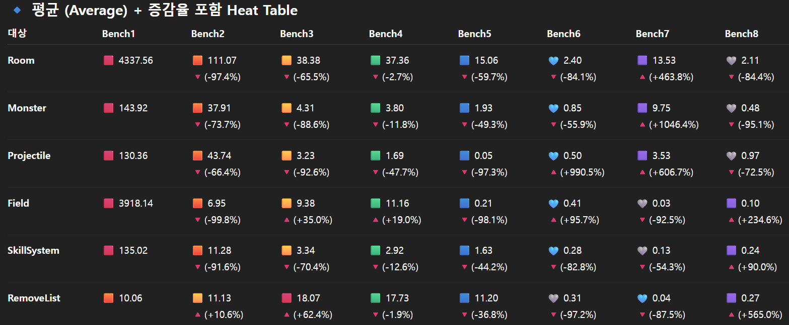
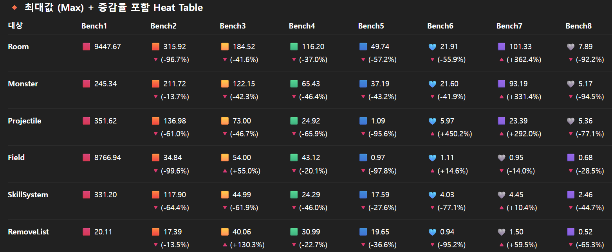
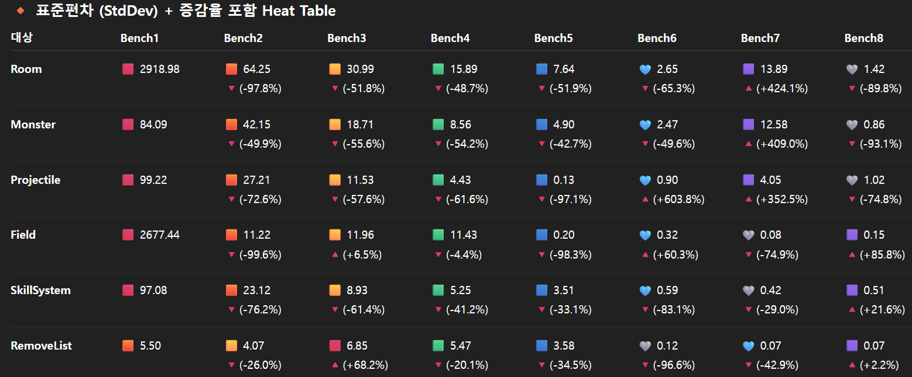

# 🧪 MMO Server Tick Optimization Report

---

## 1. 프로젝트 개요

- 프로젝트: MMO Server "S1"
- 역할: 서버 프로그래머 (핵심 로직/성능 최적화)
- 환경: C++17, Protobuf, Unreal Engine 5
- 목표: 서버 Tick 안정화, Broadcast/Packet 처리 최적화

---

## 2. 문제 정의

서버 성능 병목 및 불필요 연산으로 발생한 문제:

- 특정 Field에서 Tick 폭발로 패킷 과다 전송
- Broadcast Job 처리 병목, Room Tick Interval 밀림
- AI/Projectile 연산 중복으로 CPU 부하 발생
- 실제 플레이 환경에서 Monster Tick 폭발 확인
- RayCasting 연산 비효율

> 핵심 목표: 문제 발견 → 원인 분석 → 최적화 적용 → 성능 개선

---

## 3. 단계별 벤치마크 및 최적화

| Step | Issue | Action | Before (ms) | After (ms) | Improvement |
|------|-------|--------|-------------|------------|------------|
| 1 | 초기 상태 | - | 4337.56 | - | - |
| 2 | Target마다 Packet 전송 → Tick 폭발 | AoE/DoT Batch 처리, 단일 Tick 내 모든 Target 처리 | 3918.14 | 6.95 | **-99.8%** |
| 3 | 인덱싱 및 루프 비효율 | Spatial Hashing 적용, Nearby Broadcast 최적화, Loop 감소, Packet 분산 처리 | 111.07 | 38.38 | **-65.5%** |
| 4 | AI 및 Projectile 병목 | Projectile Sync 분리, Field 범위 캐싱, AI 로직 분산 | 38.38 | 37.36 | **-2.7%** |
| 5 | Update 동기 Broadcast → 병목 | Update/IO Async 처리로 병목 제거 | 37.36 | 15.06 | **-59.7%** |
| 6 | Room Tick Interval 밀림 | Room별 Broadcast Queue 분리 → Broadcast와 Room Logic 완전 분리 | 15.06 | 2.40 | **-84.1%** |
| 7 | 실제 플레이에서 Monster Tick 폭발 | Dummy가 아닌 실제 플레이 환경에서 성능 확인 | 2.40 | 13.53 | **+463.8%** |
| 8 | RayCasting 연산 과다 | 불필요 연산 제거, 루프 최대 250배 감소 (Object 속도에 따라 차이) | 13.53 | 2.11 | **-84.4%** |

---

## 4. 개선 전략 요약

1. Packet 처리 병목 제거: Batch 처리 적용  
2. Spatial Hashing 및 Loop 감소: Nearby Broadcast 최적화  
3. AI/Projectile 연산 병목 분리: 캐싱 + 병렬 처리  
4. Async 적용: Update 로직과 IO 분리  
5. Room 단위 Broadcast Queue 분리: Room Tick 안정화  
6. 실제 플레이 벤치마크로 정확한 성능 검증  
7. RayCasting 최적화: 연산 루프 최소화

---

## 5. 결과

- 초기 Tick Delay: 4337.56ms → 최종 평균: 2.11ms  
- CPU 사용률 감소 및 Broadcast 안정화  
- Room/Field Tick 안정화  
- 평균 70~80% 이상 성능 개선 달성

---

## 6. 배운 점

- 문제 발견 → 분석 → 개선 → 벤치마크 반복 과정이 최적화 핵심  
- Tick, Broadcast, Packet 구조 설계가 성능 병목 주요 원인  
- Async 처리 및 구조적 분리가 가장 큰 개선 효과 제공  
- 실제 플레이 환경 검증 중요